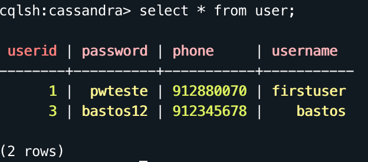

# Lab3.1

## Keyspaces

#### Creating a keyspace 
	create keyspace cassandra with replication = {'class': 'SimpleStrategy', 'replication_factor' : '3'};
	
#### Describing a keyspace
	describe cassandra;
	
#### Using a keyspace
	use cassandra;
	
#### Changing a keyspace
	alter keyspace cassandra with replication = {'class': 'SimpleStrategy', 'replication_factor' : '5'};
	
#### Dropping a keyspace 
	drop keyspace cassandra;
	
## Table Operations

#### Creating a table
	create table user(
    userId int primary key,
    username text,
    password text,
    phone varint
	);

#### Describing a table
	describe user;
	
#### Dropping a table
	drop table user;
	
## CRUD Operations

#### Inserting element
	insert into user (userId, username, password, phone) values(1,'userteste', 'pwteste', 912880070);
	insert into user (userId, username, password, phone) values(2,'edu', 'edu350', 965430065);
	insert into user (userId, username, password, phone) values(3,'bastos', 'bastos12', 912345678);
	
#### Updating element
	update user set username='firstuser' where userId=1;
	
#### Deleting an element
	delete from user where userId=2;
	
#### Displaying the table
	select * from user;	
	

## Collections

### List

#### Creating a list
	create table data(name text primary key, phone list<varint>);
	
#### Inserting
	insert into data(name, phone) values ('bastos',[912345678,234887654, 965397652]);

#### Updating
	update data set phone = phone + [921233325] where name = 'bastos';
	
### Set
	Similar to list, but with a set<> instead.
	
### Map

#### Creating a map
	create table map (name text primary key, sports map<text, varint>);
	
#### Inserting
	insert into map (name, sports) values ('bastos', {'futebol': 8, 'basquetebol': 5, 'futsal': 1});
	
#### Updating
	update map set sports = sports + {'futsal': 2} where name = 'bastos';
	
## Time-to-live & Timestamp

### Time-to-live (inserting a value for 20 seconds)
	insert into data(name, phone) values ('edu', [932256781, 966233749]) using ttl 20;
	
### Timestamp
	alter table user add ts timestamp;
	
	update user set ts='2020-2-12' where userId=3;

	

