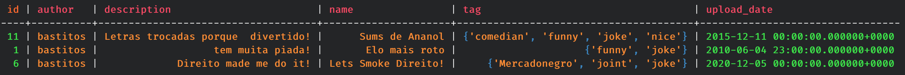
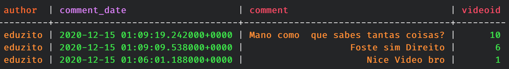
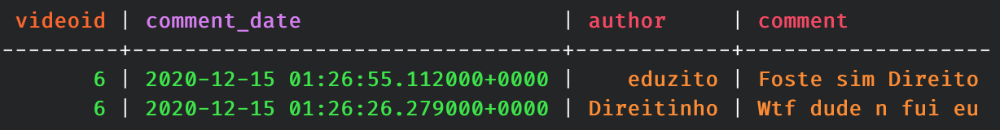
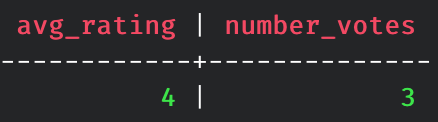
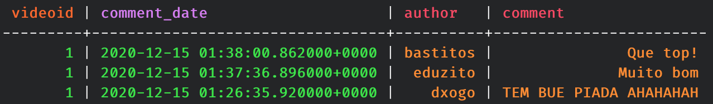
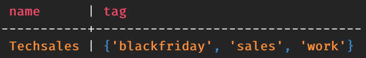
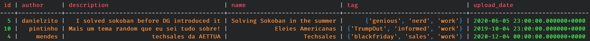
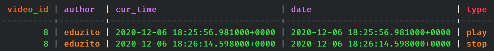
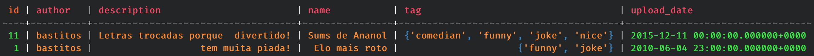
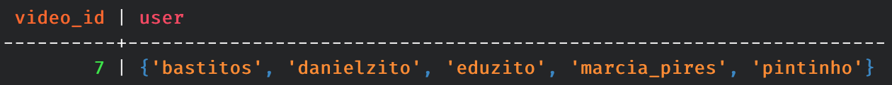

# Lab 3.2

## Video Sharing System

### a)

### Creating a keyspace
	> create keyspace videos with replication = {'class': 'SimpleStrategy', 'replication_factor' : 3};
	> use videos;
	
### Creating the tables

#### User
	> create table user(
          ... username text primary key,
          ... name text,
          ... email text,
          ... date timestamp
          ... );

#### Video
	> create table video(
          ... id int primary key,
          ... author text,
          ... name text,
          ... description text,
          ... tag set<text>,
          ... upload_date timestamp
          ... );
          
#### Comments
	> create table comment(
          ... id int primary key,
          ... videoId int,
          ... text text,
          ... date timestamp,
          ... author text
          ... );

	> create table comment_by_time(
			... author text, 
			... videoId int, 
			... comment text, 
			... comment_date timestamp,  
			... primary key(author, comment_date)) 
			... with clustering order by (comment_date desc);
			
	> create table comment_by_video(
			... author text, 
			... videoId int, 
			... comment text, 
			... comment_date timestamp,  
			... primary key(videoId, comment_date)) 
			... with clustering order by (comment_date desc);
          
#### Followers
	> create table follower(
          ... video_id int primary key,
          ... user set<text>
          ... );
          
#### Events
	> create table event(
          ... video_id int,
          ... author text,
          ... type text,
          ... cur_time timestamp,
          ... date timestamp,
          ...
          ... primary key (video_id, author, cur_time, date)
          ... );
          
#### Rating
	> create table rating(
          ... videoId int,
          ... rating int,
          ...
          ... primary key (videoId, rating)
          ... );

### b)

### Inserting data

#### User
	> insert into user (username, name, email, date) values ('bastitos', 'Pedro Bastos', 'pedro.bas@ua.pt', toTimestamp(now()));
	> insert into user (username, name, email, date) values ('eduzito', 'Eduardo Santos', 'eduardosantoshf@ua.pt', toTimestamp(now()));
	> insert into user (username, name, email, date) values ('danielzito', 'Daniel Gomes', 'dgomes@ua.pt', toTimestamp(now()));
	> insert into user (username, name, email, date) values ('Direitinho', 'Rafael Direito', 'rafadireito@ua.pt', toTimestamp(now()));
	> insert into user (username, name, email, date) values ('pintinho', 'Gonçalo Pinto', 'gpinto@ua.pt', toTimestamp(now()));
	> insert into user (username, name, email, date) values ('valente', 'Pedro Valente', 'valente@ua.pt', toTimestamp(now()));
	> insert into user (username, name, email, date) values ('mendes', 'Diogo Mendes', 'mendesdiogo@ua.pt', toTimestamp(now()));
	> insert into user (username, name, email, date) values ('marcia_pires', 'Márcia Pires', 'mpires@ua.pt', toTimestamp(now()));
	> insert into user (username, name, email, date) values ('dxogo', 'Diogo Cruz', 'dioguinho@ua.pt', toTimestamp(now()));
	> insert into user (username, name, email, date) values ('hugofpaiva', 'Hugo Paiva', 'hugop@ua.pt', toTimestamp(now()));
	
#### Video
	> insert into video (id, author, name, description, tag, upload_date) values (1, 'bastitos', 'Elo mais roto', 'tem muita piada!', {'joke', 'funny'}, '2010-6-5');
	> insert into video (id, author, name, description, tag, upload_date) values (2, 'eduzito', 'Tripaloski', 'Russos a dançar!', {'joke', 'funny', 'russian', 'vodka'}, '2012-4-12');
	> insert into video (id, author, name, description, tag, upload_date) values (3, 'dxogo', 'Bayern 8-2 Barça', 'Humilhação!', {'football', 'rekt'}, '2019-12-3');
	> insert into video (id, author, name, description, tag, upload_date) values (4, 'mendes', 'Techsales', 'techsales da AETTUA', {'work', 'blackfriday', 'sales'}, '2020-12-4');
	> insert into video (id, author, name, description, tag, upload_date) values (5, 'danielzito', 'Solving Sokoban in the summer', 'I solved sokoban before DG introduced it', {'work', 'genious', 'nerd'}, '2020-6-6');
	> insert into video (id, author, name, description, tag, upload_date) values (6, 'bastitos', 'Lets Smoke Direito!', 'Direito made me do it!', {'joke', 'joint', 'Mercadonegro'}, '2020-12-5');
	> insert into video (id, author, name, description, tag, upload_date) values (7, 'eduzito', 'Poema da Carlota', 'Fiz um poema para a minha amada', {'casamento', 'carlota', 'love'}, '2020-12-3');
	> insert into video (id, author, name, description, tag, upload_date) values (8, 'hugofpaiva', 'Implementing django filters', 'Im the best!', {'django', 'programmer', 'pro'}, '2015-2-2');
	> insert into video (id, author, name, description, tag, upload_date) values (9, 'marcia_pires', 'Video na biblioteca', 'Biblioteca é vida!', {'library', 'life'}, '2000-12-12');
	> insert into video (id, author, name, description, tag, upload_date) values (10, 'pintinho', 'Eleições Americanas', 'Mais um tema random que eu sei tudo sobre!', {'informed', 'work', 'TrumpOut'}, '2019-10-5');
	> insert into video (id, author, name, description, tag, upload_date) values (11, 'bastitos', 'Sumás de Ananol', 'Letras trocadas porque é divertido!', {'funny', 'joke', 'comedian', 'nice'}, '2015-12-11');
	
#### Comment
	
	comment
	
	> insert into comment (id, videoId, text, date, author) values (1, 1, 'Nice Video bro', toTimestamp(now()), 'eduzito');
	> insert into comment (id, videoId, text, date, author) values (2, 6, 'Wtf dude n fui eu', toTimestamp(now()), 'Direitinho');
	> insert into comment (id, videoId, text, date, author) values (3, 4, 'Mano as contas estão mal feitas', toTimestamp(now()), 'pintinho');
	> insert into comment (id, videoId, text, date, author) values (4, 1, 'TEM BUE PIADA AHAHAHAH', toTimestamp(now()), 'dxogo');
	> insert into comment (id, videoId, text, date, author) values (5, 9, 'Tas sempre na biblio?', toTimestamp(now()), 'valente');
	> insert into comment (id, videoId, text, date, author) values (6, 8, 'Bro és um craque ensina-me', toTimestamp(now()), 'danielzito');
	> insert into comment (id, videoId, text, date, author) values (7, 5, 'Mano como é que consegues explica-me IA', toTimestamp(now()), 'bastitos');
	> insert into comment (id, videoId, text, date, author) values (8, 6, 'Foste sim Direito', toTimestamp(now()), 'eduzito');
	> insert into comment (id, videoId, text, date, author) values (9, 11, 'Mano incrível essa troca de palavras', toTimestamp(now()), 'hugofpaiva');
	> insert into comment (id, videoId, text, date, author) values (10, 10, 'Mano como é que sabes tantas coisas?', toTimestamp(now()), 'eduzito');
	
	
	comment_by_time
	
	> insert into comment_by_time (author, videoId, comment, comment_date) values ('eduzito', 1, 'Nice Video bro', toTimestamp(now()));
	> insert into comment_by_time (author, videoId, comment, comment_date) values ('Direitinho', 6, 'Wtf dude n fui eu', toTimestamp(now()));
	> insert into comment_by_time (author, videoId, comment, comment_date) values ('pintinho', 4, 'Mano as contas estão mal feitas', toTimestamp(now()));
	> insert into comment_by_time (author, videoId, comment, comment_date) values ('dxogo', 1, 'TEM BUE PIADA AHAHAHAH', toTimestamp(now()));
	> insert into comment_by_time (author, videoId, comment, comment_date) values ('valente', 9, 'Tas sempre na biblio?', toTimestamp(now()));
	> insert into comment_by_time (author, videoId, comment, comment_date) values ('danielzito', 8, 'Bro és um craque ensina-me', toTimestamp(now()));
	> insert into comment_by_time (author, videoId, comment, comment_date) values ('bastitos', 5, 'Mano como é que consegues explica-me IA', toTimestamp(now()));
	> insert into comment_by_time (author, videoId, comment, comment_date) values ('eduzito', 6, 'Foste sim Direito', toTimestamp(now()));
	> insert into comment_by_time (author, videoId, comment, comment_date) values ('hugofpaiva', 11, 'Mano incrível essa troca de palavras', toTimestamp(now()));
	> insert into comment_by_time (author, videoId, comment, comment_date) values ('eduzito', 10, 'Mano como é que sabes tantas coisas?', toTimestamp(now()));
	
	
	comment_by_video
	
	> insert into comment_by_video (author, videoId, comment, comment_date) values ('eduzito', 1, 'Nice Video bro', toTimestamp(now()));
	> insert into comment_by_video (author, videoId, comment, comment_date) values ('Direitinho', 6, 'Wtf dude n fui eu', toTimestamp(now()));
	> insert into comment_by_video (author, videoId, comment, comment_date) values ('pintinho', 4, 'Mano as contas estão mal feitas', toTimestamp(now()));
	> insert into comment_by_video (author, videoId, comment, comment_date) values ('dxogo', 1, 'TEM BUE PIADA AHAHAHAH', toTimestamp(now()));
	> insert into comment_by_video (author, videoId, comment, comment_date) values ('valente', 9, 'Tas sempre na biblio?', toTimestamp(now()));
	> insert into comment_by_video (author, videoId, comment, comment_date) values ('danielzito', 8, 'Bro és um craque ensina-me', toTimestamp(now()));
	> insert into comment_by_video (author, videoId, comment, comment_date) values ('bastitos', 5, 'Mano como é que consegues explica-me IA', toTimestamp(now()));
	> insert into comment_by_video (author, videoId, comment, comment_date) values ('eduzito', 6, 'Foste sim Direito', toTimestamp(now()));
	> insert into comment_by_video (author, videoId, comment, comment_date) values ('hugofpaiva', 11, 'Mano incrível essa troca de palavras', toTimestamp(now()));
	> insert into comment_by_video (author, videoId, comment, comment_date) values ('eduzito', 10, 'Mano como é que sabes tantas coisas?', toTimestamp(now()));
	> insert into comment_by_video (author, videoId, comment, comment_date) values ('eduzito', 1, 'Muito bom', toTimestamp(now()));
	> insert into comment_by_video (author, videoId, comment, comment_date) values ('bastitos', 1, 'Que top!', toTimestamp(now()));

	
#### Followers
	> insert into follower (video_id, user) values (1, {'eduzito', 'hugofpaiva', 'danielzito'});
	> insert into follower (video_id, user) values (2, {'bastitos', 'valente', 'pintinho', 'Direitinho'});
	> insert into follower (video_id, user) values (3, {'eduzito'});
	> insert into follower (video_id, user) values (4, {'bastitos', 'danielzito'});
	> insert into follower (video_id, user) values (5, {'marcia_pires', 'mendes'});
	> insert into follower (video_id, user) values (6, {'dxogo'});
	> insert into follower (video_id, user) values (7, {'bastitos', 'marcia_pires', 'danielzito', 'eduzito', 'pintinho'});
	> insert into follower (video_id, user) values (8, {'mendes', 'hugofpaiva'});
	> insert into follower (video_id, user) values (9, {'marcia_pires', 'hugofpaiva', 'danielzito'});
	> insert into follower (video_id, user) values (10, {'bastitos', 'eduzito'});
	> insert into follower (video_id, user) values (11, {'valente'});
	
#### Event
	> insert into event (video_id, author, type, cur_time, date) values (1, 'bastitos', 'play', toTimestamp(now()), toTimestamp(now()));
	> insert into event (video_id, author, type, cur_time, date) values (1, 'eduzito', 'play', toTimestamp(now()), toTimestamp(now()));
	> insert into event (video_id, author, type, cur_time, date) values (1, 'Direitinho', 'pause', toTimestamp(now()), toTimestamp(now()));
	> insert into event (video_id, author, type, cur_time, date) values (4, 'valente', 'stop', toTimestamp(now()), toTimestamp(now()));
	> insert into event (video_id, author, type, cur_time, date) values (6, 'danielzito', 'pause', toTimestamp(now()), toTimestamp(now()));
	> insert into event (video_id, author, type, cur_time, date) values (11, 'hugofpaiva', 'stop', toTimestamp(now()), toTimestamp(now()));
	> insert into event (video_id, author, type, cur_time, date) values (2, 'mendes', 'play', toTimestamp(now()), toTimestamp(now()));
	> insert into event (video_id, author, type, cur_time, date) values (11, 'pintinho', 'pause', toTimestamp(now()), toTimestamp(now()));
	> insert into event (video_id, author, type, cur_time, date) values (7, 'bastitos', 'pause', toTimestamp(now()), toTimestamp(now()));
	> insert into event (video_id, author, type, cur_time, date) values (10, 'dxogo', 'play', toTimestamp(now()), toTimestamp(now()));
	> insert into event (video_id, author, type, cur_time, date) values (10, 'eduzito', 'stop', toTimestamp(now()), toTimestamp(now()));
	> insert into event (video_id, author, type, cur_time, date) values (8, 'eduzito', 'play', toTimestamp(now()), toTimestamp(now()));
	> insert into event (video_id, author, type, cur_time, date) values (8, 'eduzito', 'stop', toTimestamp(now()), toTimestamp(now()));
	> insert into event (video_id, author, type, cur_time, date) values (5, 'hugofpaiva', 'pause', toTimestamp(now()), toTimestamp(now()));
	> insert into event (video_id, author, type, cur_time, date) values (3, 'bastitos', 'stop', toTimestamp(now()), toTimestamp(now()));
	
#### Rating
	> insert into rating (videoId, rating) values (1, 4);
	> insert into rating (videoId, rating) values (1, 3);
	> insert into rating (videoId, rating) values (1, 5);
	> insert into rating (videoId, rating) values (1, 4);
	> insert into rating (videoId, rating) values (2, 2);
	> insert into rating (videoId, rating) values (2, 1);
	> insert into rating (videoId, rating) values (3, 5);
	> insert into rating (videoId, rating) values (4, 4);
	> insert into rating (videoId, rating) values (4, 3);
	> insert into rating (videoId, rating) values (5, 1);
	> insert into rating (videoId, rating) values (6, 5);
	> insert into rating (videoId, rating) values (6, 5);
	> insert into rating (videoId, rating) values (6, 4);
	> insert into rating (videoId, rating) values (7, 4);
	> insert into rating (videoId, rating) values (7, 3);
	> insert into rating (videoId, rating) values (8, 1);
	> insert into rating (videoId, rating) values (8, 2);
	> insert into rating (videoId, rating) values (10, 5);
	> insert into rating (videoId, rating) values (10, 4);
	> insert into rating (videoId, rating) values (10, 3);
	> insert into rating (videoId, rating) values (11, 4);
	> insert into rating (videoId, rating) values (11, 2);

### JSON data

### CQL DML statements

	> select json * from user;
	> select json * from video;
	> select json * from comment;
	> select json * from comment_by_time;
	> select json * from comment_by_video;
	> select json * from follower;
	> select json * from event;
	> select json * from rating;

### c)

#### Querie 7
	> select * from video where author='bastitos' allow filtering;
	

#### Querie 8
	> select * from comment_by_time where author='eduzito';
	

#### Querie 9
	> select * from comment_by_video where videoId=6;
	

#### Querie 10
	> select avg(rating) as avg_rating, count(rating) as number_votes from rating where videoid=1;
	

### d)

#### Querie 1
	> select * from comment_by_video where videoId=1 limit 3;
	

#### Querie 2
	> select name, tag from video where id=4;
	

#### Querie 3
	> select * from video where tag contains 'work' allow filtering;
	

#### Querie 4
	> select * from event where author='eduzito' and video_id=8 limit 5;
	

#### Querie 5
	> select * from video where author='bastitos' and upload_date > '2010-06-03' and upload_date < '2015-12-12'  allow filtering;
	

#### Querie 6
	Can´t be done. Without a partition key, we cannot have the clustering column ordering.
	
#### Querie 7
	> select * from follower where video_id=7;
	

#### Querie 8
	Joins are not possible in Cassandra. To do this, we would need to create a new table.
	
#### Querie 9
	Can´t be done, same reason as querie 6.
	
#### Querie 10
	Couldn't find a way to make this work.
	
#### Querie 11
	Same as querie 8. There is a need to create another table.

	
	