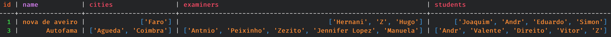
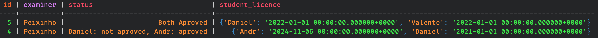
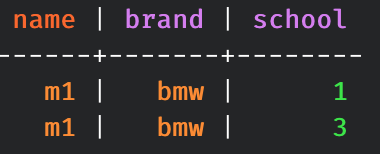
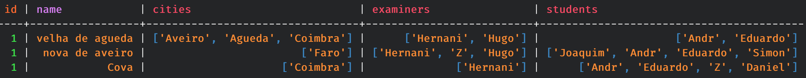

# 3.4

### Simple database for driving exams

## Keyspace

	> create keyspace drive with replication = {'class': 'SimpleStrategy', 'replication_factor' : 3};
	> use drive;

## Creating the tables

#### Student

	> create table student(
         ... name text primary key,
         ... licence timestamp,
         ... disabilities set<text>,
         ... details text);
         
#### Examiner

	> create table examiner(
         ... id int,
         ... name text,
         ... school text,
         ... primary key(id, name, school)
         ... );
         
#### School

	> create table school(
         ... id int,
         ... name text,
         ... cities list<text>,
         ... examiners list<text>,
         ... students list<text>,
         ... primary key(id, name)
         ... );
         
#### Vehicle

	> create table vehicle(
         ... name text,
         ... brand text,
         ... school int,
         ... primary key(name, brand, school)
         ... );
         
#### Exam

	> create table exam(
         ... id int,
         ... student_licence map<text, text>,
         ... examiner text,
         ... status text,
         ... primary key(id, examiner)
         ... );
         
## Inserting values

#### Student

	> insert into student(name, licence, disabilities, details) values ('Joaquim', '2025-12-11', {'vision', 'left arm'}, 'very good');
	> insert into student(name, licence, disabilities, details) values ('André', '2024-11-06', {'audition'}, 'needs more lessons');
	> insert into student(name, licence, disabilities, details) values ('Eduardo', '2026-01-05', {}, 'exceptional driver');
	> insert into student(name, licence, disabilities, details) values ('Hugo', '2030-12-12', {'Sight'}, 'A bit impulsive');
	> insert into student(name, licence, disabilities, details) values ('Daniel', '2021-01-01', {'Mental issues', 'depression', 'broken arm'}, 'Gets really nervous');
	> insert into student(name, licence, disabilities, details) values ('Valente', '2022-01-01', {}, 'Very angry');
	> insert into student(name, licence, disabilities, details) values ('Direito', '2023-02-03', {'diabetes', 'OCD', 'PTSD', 'ADHD'}, 'Very angry');
	> insert into student(name, licence, disabilities, details) values ('Gonçalo', '2024-02-03', {}, 'Drives fast');
	> insert into student(name, licence, disabilities, details) values ('Gil', '2026-10-25', {'ADHD', 'Sight'}, '');
	> insert into student(name, licence, disabilities, details) values ('Vitor', '2034-01-12', {'Audition', 'OCD'}, 'Dangerous driver');
	> insert into student(name, licence, disabilities, details) values ('Zé', '2019-02-11', {'OCD', 'ADHD'}, 'Really good driver');
	> insert into student(name, licence, disabilities, details) values ('Tomás', '2022-09-08', {'Pulmonar'}, 'Drives very good');
	
#### Examiner

	> insert into examiner(id, name, school) values (1, 'Hernani', 'nova de aveiro');
	> insert into examiner(id, name, school) values (2, 'Gil', 'Miguel de Agueda');
	> insert into examiner(id, name, school) values (3, 'António', 'Autofama');
	> insert into examiner(id, name, school) values (4, 'Zé', 'nova de aveiro');
	> insert into examiner(id, name, school) values (5, 'Peixinho', 'Autofama');
	> insert into examiner(id, name, school) values (6, 'Zezito', 'Autofama');
	> insert into examiner(id, name, school) values (7, 'Jennifer Lopez', 'Autofama');
	> insert into examiner(id, name, school) values (8, 'Hugo', 'nova de aveiro');
	> insert into examiner(id, name, school) values (9, 'Daniel', 'Miguel de Agueda');
	> insert into examiner(id, name, school) values (10, 'Teixeira', 'Costa Verde');
	> insert into examiner(id, name, school) values (11, 'Manuela', 'Autofama');
	> insert into examiner(id, name, school) values (12, 'Mico', 'Costa Verde');
	
#### School

	> insert into school(id, name, cities, examiners, students) values (1, 'nova de aveiro', ['Aveiro', 'Agueda'], ['Hernani', 'Zé', 'Hugo'], ['Joaquim', 'André', 'Eduardo']);
	> insert into school(id, name, cities, examiners, students) values (1, 'velha de agueda', ['Aveiro', 'Agueda', 'Coimbra'], ['Hernani', 'Hugo'], ['André', 'Eduardo']);
	> insert into school(id, name, cities, examiners, students) values (1, 'Cova', ['Coimbra'], ['Hernani'], ['André', 'Eduardo', 'Zé', 'Daniel']);
	> insert into school(id, name, cities, examiners, students) values (2, 'Miguel de Agueda', ['Aveiro', 'Agueda', 'Leiria', 'Oliveira do Bairro'], ['Gil', 'Daniel'], ['Hugo']);
	> insert into school(id, name, cities, examiners, students) values (3, 'Autofama', ['Agueda', 'Coimbra'], ['António', 'Peixinho', 'Zezito', 'Jennifer Lopez', 'Manuela'], ['André', 'Valente', 'Direito', 'Vitor', 'Zé']);
	> insert into school(id, name, cities, examiners, students) values (4, 'Costa Verde', ['Espinho', 'Lisboa'], ['Teixeira', 'Mico'], ['Tomás', 'Daniel', 'Gonçalo']);
	
#### Vehicle

	> insert into vehicle(name, brand, school) values ('m1', 'bmw', 1);
	> insert into vehicle(name, brand, school) values ('golf', 'Volkswagen', 1);
	> insert into vehicle(name, brand, school) values ('A3', 'Audi', 1);
	> insert into vehicle(name, brand, school) values ('m2', 'bmw', 2);
	> insert into vehicle(name, brand, school) values ('Ibiza', 'Seat', 2);
	> insert into vehicle(name, brand, school) values ('Ateca', 'Seat', 3);
	> insert into vehicle(name, brand, school) values ('Ibiza', 'Seat', 3);
	> insert into vehicle(name, brand, school) values ('m1', 'bmw', 3);
	> insert into vehicle(name, brand, school) values ('m2', 'bmw', 3);
	> insert into vehicle(name, brand, school) values ('m3', 'bmw', 3);
	> insert into vehicle(name, brand, school) values ('Polo', 'Volkswagen', 4);
	> insert into vehicle(name, brand, school) values ('m1', 'bmw', 4);
	
#### Exam

	> insert into	 exam(id, student_licence, examiner, status) values (1, {'Joaquim': '2025-12-11', 'André': '2024-11-06'}, 'Hernani', 'Joaquim: aproved, André: not aproved');
	> insert into	 exam(id, student_licence, examiner, status) values (2, {'Eduardo': '2026-01-05', 'Hugo': '2030-12-12'}, 'Hernani', 'Both not aproved');
	> insert into	 exam(id, student_licence, examiner, status) values (3, {'Eduardo': '2026-01-05', 'Hugo': '2030-12-12'}, 'António', 'Both Aproved');
	> insert into	 exam(id, student_licence, examiner, status) values (4, {'Daniel': '2021-01-01', 'André': '2024-11-06'}, 'Peixinho', 'Daniel: not aproved, André: aproved');
	> insert into	 exam(id, student_licence, examiner, status) values (5, {'Daniel': '2021-01-01', 'Valente': '2022-01-01'}, 'Peixinho', 'Both Aproved');
	> insert into	 exam(id, student_licence, examiner, status) values (6, {'Direito': '2023-02-03', 'Gonçalo': '2024-02-03'}, 'Hugo', 'Both not aproved');
	> insert into	 exam(id, student_licence, examiner, status) values (7, {'Direito': '2023-02-03', 'Gonçalo': '2024-02-03'}, 'Hugo', 'Direito: aproved, Gonçalo: not aproved');
	> insert into	 exam(id, student_licence, examiner, status) values (8, {'Gonçalo': '2024-02-03', 'Gil': '2026-10-25'}, 'Hugo', 'Gonçalo: Aproved, Gil: not aproved');
	> insert into	 exam(id, student_licence, examiner, status) values (9, {'Gil': '2026-10-25', 'Vitor': '2034-01-12'}, 'Hugo', 'Gil: aproved, Vitor: not aproved');
	> insert into	 exam(id, student_licence, examiner, status) values (10, {'Vitor': '2034-01-12', 'Zé': '2019-02-11'}, 'Mico', 'Both not aproved');
	> insert into	 exam(id, student_licence, examiner, status) values (11, {'Vitor': '2034-01-12', 'Zé': '2019-02-11'}, 'Mico', 'Vitor: aproved, zé: not aproved');
	> insert into	 exam(id, student_licence, examiner, status) values (12, {'Zé': '2019-02-11', 'Tomás': '2022-09-08'}, 'Manuela', 'Both Aproved');

## Indexes

#### Index on table 'school' in column 'students'

	> create index students on school(students);
	
#### Index on table 'exam' in column 'student_licence'

	> create index licences on exam(student_licence);
	
## UPDATES and DELETES

#### Updates

	> update student set disabilities = disabilities + {'Asma'} where name='Joaquim';
	> update school set cities = ['Faro', 'Braga'], students = students + ['Simon'] where id = 1 and name='nova de aveiro';
	> update exam set student_licence['Daniel'] = '2022-01-01' where id=5 and examiner='Peixinho';
	> update exam set studen_licence = student_licence + {'Zé': '2025-01-01'} where id=1 and examiner='Hernani';
	> update exam set student_licence = student_licence - {'Zé'} where id=1 and examiner='Hernani';
	
#### Deletes

	> delete student_licence['Vitor'] from exam where id=10 and examiner='Mico';
	> delete cities[1] from school where id=1 and name='nova de aveiro';
	> delete cities[0], cities[1], examiners[0] from school where id=2 and name='Miguel de Agueda';
	> delete from vehicle where name='Ibiza';
	> delete disabilities from student where name='Direito';
	
## Queries

#### Get the schools that have 1 or more students named 'Andr':
	
	> select * from school where students contains 'Andr';
	

#### Get the exams that have the student 'Daniel':

	> select * from exam where student_licence contains key 'Daniel' allow filtering;
	

#### Get first 2 vehicles that have the name 'm1':

	> select * from vehicle where name='m1' limit 2;
	

#### Get schools with id 1 and order them in reverse:

	> select * from school where id=1 order by name desc;
	

	
	
	
	
	
	
	
	
	
	
	
	
	
	
